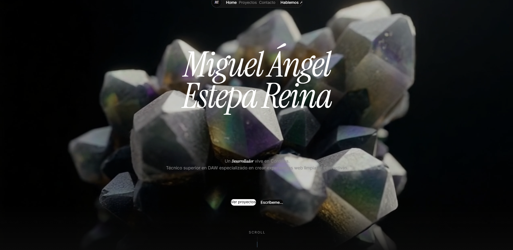

# Portfolio — Miguel Ángel Estepa Reina


Mi portfolio personal como desarrollador web: quién soy, mis proyectos con demo en vivo, las tecnologías que uso y cómo contactarme o descargar mi CV.

También es un proyecto en sí mismo: un sitio de una sola página con animaciones cuidadas, vídeo de fondo y diseño propio, sin plantillas.

## Demo

🌐 **En vivo:** [**mestepa12.github.io/Portfolio**](https://mestepa12.github.io/Portfolio/)

## Capturas



## Tecnologías

- **React 19** + **TypeScript** con Vite 8
- **Tailwind CSS 4** mediante el plugin oficial de Vite (`@tailwindcss/vite`)
- **GSAP** para la secuencia de entrada de la portada y la cinta infinita del pie
- **Framer Motion** para la pantalla de carga (`AnimatePresence`) y las animaciones al hacer scroll (`whileInView`)
- **ESLint** con `typescript-eslint` y las reglas de hooks de React

## Instalación y ejecución en local

**Requisitos:** Node.js 20.19+ o 22.12+ (los que exige Vite 8).

```bash
npm install
npm run dev        # http://localhost:5173/Portfolio/
npm run build      # comprueba los tipos (tsc -b) y genera dist/
npm run preview    # sirve el build para revisarlo
```

**Despliegue:** el contenido de `dist/` se publica en el repositorio [`mestepa12/Portfolio`](https://github.com/mestepa12/Portfolio), que sirve GitHub Pages. `base: '/Portfolio/'` en `vite.config.ts` hace que las rutas funcionen bajo ese subdirectorio.

---

## Lo más destacado técnicamente

- **Animaciones que no se pierden.** Las secciones no se montan hasta que termina la pantalla de carga. Así las animaciones de entrada empiezan cuando el usuario ya las está viendo, y no mientras siguen tapadas por el loader.
- **GSAP bien integrado con React.** `gsap.context()` limita los selectores a su sección y `revert()` limpia al desmontar. Sin eso, con `StrictMode` las animaciones se duplicarían en desarrollo.
- **Contador de carga con `requestAnimationFrame`** en lugar de `setInterval`: avanza al ritmo del repintado y llega a 100 justo a tiempo.
- **Rutas preparadas para GitHub Pages.** Todos los recursos (vídeo, imágenes, CV) usan `import.meta.env.BASE_URL`, así que el sitio funciona igual en local y en `/Portfolio/`.
- **Clases de Tailwind escritas completas.** El ancho de las tarjetas de proyecto (`md:col-span-*`) sale de un mapa con los nombres de clase enteros. Tailwind busca las clases leyendo el código fuente como texto, así que una clase construida por interpolación no llegaría al CSS final.
- **Cinta infinita sin saltos.** El texto va repetido y se desplaza un −50 %, de modo que el bucle vuelve a empezar sin que se note el corte.
